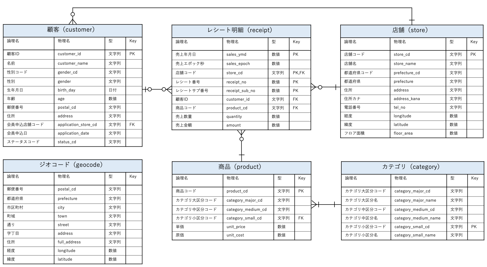

**参考記事 :**

- {}
- {}

## はじめに

当サイトでは、「データサイエンス100本ノック＋α」と題し、100本ノックの演習問題をベースに、R を使ったデータベース操作を交えて解説します。

- **シリーズ構成**
  - **標準編** : 100本ノックの中から約30本を選び、R と SQL を用いて解説
  - **発展編** : オリジナル問題を作成し、より多くの構文を用いたデータ処理を紹介 (予定)
<p>

- **解説方針**  
  各問題について、以下のコードを紹介します。
  - **Rコード (データフレーム操作)**
  - **Rコード (データベース操作)**
  - **SQLクエリ**

サンプルコードは、可読性と効率を重視し、できるだけエレガントな記述を心がけたいと思います。

## 環境構築

本シリーズでは、Docker や Jupyter Notebook などの環境を必要とせず、**RStudio などの R 実行環境** があれば十分です。
私は VSCode を愛用していますが、RStudio でも問題なく動作します。

### 手順

#### 1. GitHub リポジトリをクローンする

以下のコマンドでリポジトリをクローンします。

```sh
cd /your_directory_path
git clone https://github.com/xxx/100knocks-dp.git
```

`100knocks-dp` が作成され、ディレクトリ構成は以下のようになります。

```text {name="100knocks-dp"}
work
  ├── DB
  │   └── _ReadMe.txt
  ├── data
  │   └── _ReadMe.txt
  ├── data_setup.R
  ├── env_setup.R
  ├── functions.R
  └── init.R
```

#### 2. init.R を実行する

RStudio などで `init.R` を開いて実行します。  
実行後、以下のようなディレクトリ構成になります。

```text {name="100knocks-dp"}
work
  ├── DB
  │   ├── 100knocks.duckdb
  │   └── _ReadMe.txt
  ├── data
  │   ├── 100knocks_ER.png
  │   ├── _ReadMe.txt
  │   ├── category.csv
  │   ├── customer.csv
  │   ├── geocode.csv
  │   ├── product.csv
  │   ├── receipt.csv
  │   └── store.csv
  ├── data_setup.R
  ├── env_setup.R
  ├── functions.R
  └── init.R
```

ダウンロードした 6 個の CSVファイル (`data/*.csv`)[^1] を読み込み、テーブルとしてデータベースファイル (`DB/100knocks.duckdb`) に保存しています。

[^1]: データは「」のリポジトリより、以下のディレクトリからダウンロードしています。  


R セッションを再開した場合は、再度 `init.R` を実行してください。  
2 回目からは、パッケージのインストールと CSV ファイルなどのダウンロードは不要なため、環境構築は約 5 秒で完了します。

### トラブルシューティング

もしエラーが発生した場合、作業ディレクトリの設定が原因となっている可能性が高いです。

現在の作業ディレクトリを確認するには、次のコマンドを実行してください。

```r
getwd()
```

`init.R` の以下の箇所を、

```r {name="init.R"}
work_dir_path = init_path |> dirname()
```

例えば、以下のように変更して再実行してみてください。

```r
work_dir_path = "."
```

### 利用可能なリソース

環境構築後、以下のリソースを利用できます。

#### 1. データベースファイル

`work/DB/100knocks.duckdb`

#### 2. 主な R パッケージ

- `dplyr`
- `tidyr`
- `magrittr`
- `tibble`
- `stringr`
- `lubridate`
- `DBI`
- `dbplyr`
- `duckdb`

#### 3. R オブジェクト

##### データベースの接続

- `con`

##### データフレーム

- `df_customer`
- `df_receipt`
- `df_product`
- `df_store`
- `df_category`
- `df_geocode`

##### データベースのテーブル参照

- `db_customer`
- `db_receipt`
- `db_product`
- `db_store`
- `db_category`
- `db_geocode`

##### 便利な関数

- `my_select()`
- `my_sql_render()`

#### 4. ER図 (データの構造)

本シリーズで扱う 6 個のテーブルの関係を示す ER 図です。  
場所 : `work/data/100knocks_ER.png`

<div class="gallery-image gallery-base">
  <a href="ER.png" data-width="1692" data-height="928">
    
  </a>
</div>
<span style="font-size: 0.9em;">
−より引用
</span>

{}

より引用
{}

## 補足

R によるデータベース操作や SQL クエリの自動生成について、以下の記事で紹介しています。

- {}
- {}

データベース操作に関連するその他の補足事項を `my_select()`、`my_sql_render()` の使い方と共に以下にまとめました。

### DuckDB を使用するメリット{#duckdb}

本シリーズでは、軽量かつ高速なデータベースエンジン **DuckDB** を使用します。  
DuckDB はデータサイエンス向けに設計された高性能データベースで、次のような特長があります。

- ローカル環境でのデータ分析や R との統合に適している
- PostgreSQL との互換性が高く、学習した内容を他のデータベースにも応用しやすい
- ファイルベースで手軽に扱え、インメモリモードを利用すればさらに高速な処理が可能

特に、教育目的や小規模データセットの分析に最適なため、本シリーズでは DuckDB を採用しています。

### SQL クエリを直接実行する

#### `dbGetQuery()`

`DBI::dbGetQuery()` を使用すると、指定した SQL クエリをデータベースで実行し、結果をデータフレーム (`data.frame` クラス) として取得できます。  
SQL を直接記述して実行する際に便利な関数です。

```r
query = 
  "SELECT sales_ymd, product_cd, amount FROM receipt"
d = DBI::dbGetQuery(con, query)
d %>% head(5)
```

```text
  sales_ymd product_cd amount
1  20181103 P070305012    158
2  20181118 P070701017     81
3  20170712 P060101005    170
4  20190205 P050301001     25
5  20180821 P060102007     90
```

`sql()` と組み合わせると、複雑なクエリの記述が容易になります。

```r
query = sql("
SELECT product_cd, SUM(amount) AS total_sales
FROM receipt
WHERE (sales_ymd >= 20180101)
GROUP BY product_cd
ORDER BY total_sales DESC
"
)

DBI::dbGetQuery(con, query)
```

```text
  product_cd total_sales
1 P071401001     1233100
2 P071401002      429000
3 P071401003      371800
4 P060303001      346320
5 P071401012      305800
...
```

引数 `n` を指定すると、取得するレコード数を制限できます。  

```r
DBI::dbGetQuery(con, query, n = 3)
```

```text
  product_cd total_sales
1 P071401001     1233100
2 P071401002      429000
3 P071401003      371800
```

また、`params` 引数を使用して、SQL のバインドパラメータを活用することができ、柔軟かつ安全にクエリを実行できます。

```r {hl_lines=4}
query = sql("
SELECT product_cd, SUM(amount) AS total_sales
FROM receipt
WHERE (sales_ymd >= ?)
GROUP BY product_cd
ORDER BY total_sales DESC
"
)

DBI::dbGetQuery(con, query, params = list(20190401))
```

```text
  product_cd total_sales
1 P071401001      376200
2 P071401002      158400
3 P071401003      123200
4 P060303001      117216
5 P071401013      110000
...
```

#### `my_select()`

独自関数 `my_select()` は `dbGetQuery()` のラッパー関数で、次の点を変更しています。

- デフォルトで結果を tibble として返す。
- クエリを第1引数として渡す。

使用例は以下の通りです : 

```r
query = sql("
SELECT product_cd, SUM(amount) AS total_sales
FROM receipt
WHERE (sales_ymd >= 20180101)
GROUP BY product_cd
ORDER BY total_sales DESC
"
)

query %>% my_select(con, n = 5)
```

実行結果は、次のように tibble として返されます。

```text
# A tibble: 5 × 2
  product_cd total_sales
  <chr>            <dbl>
1 P071401001     1233100
2 P071401002      429000
3 P071401003      371800
4 P060303001      346320
5 P071401012      305800
```

`convert_tibble = FALSE` を指定すると、`data.frame` クラスのデータフレームが返されますが、通常は tibble を使用することをお勧めします。

### 異なるデータベースの SQL を確認する

#### `sql_render()`

`sql_render()` を **データベースシミュレーター `simulate_*()`** と組み合わせて使用すると、異なるデータベース向けの SQL クエリを確認できます。

例えば、**PostgreSQL の SQL をシミュレーションする** 場合は `simulate_postgres()` を使います。

```r {hl_lines=["8-9"]}
db_result = db_customer %>% 
  mutate(
    m = birth_day %>% lubridate::month(), 
    .keep = "used"
  ) %>% 
  head(5)

db_result %>% 
  sql_render(con = simulate_postgres())
```

```sql
<SQL> SELECT `birth_day`, EXTRACT(MONTH FROM `birth_day`) AS `m`
FROM customer
LIMIT 5
```

このように、実際のデータベース接続なしで SQL を確認できるので便利です。

MySQL/MariaDB、Snowflake、Oracle、SQL server での SQL のシミュレーションは、以下のようになります。

- MySQL/MariaDB

```r
db_result %>% sql_render(con = simulate_mysql())
```

```sql
<SQL> SELECT `birth_day`, EXTRACT(month FROM `birth_day`) AS `m`
FROM customer
LIMIT 5
```

- Snowflake

```r
db_result %>% sql_render(con = simulate_snowflake())
```

```sql
<SQL> SELECT `birth_day`, EXTRACT('month', `birth_day`) AS `m`
FROM customer
LIMIT 5
```

- Oracle

```r
db_result %>% sql_render(con = simulate_oracle())
```

```sql
<SQL> SELECT `birth_day`, EXTRACT(month FROM `birth_day`) AS `m`
FROM customer
FETCH FIRST 5 ROWS ONLY
```

- SQL server

```r
db_result %>% sql_render(con = simulate_mssql())
```

```sql
<SQL> SELECT TOP 5 `birth_day`, DATEPART(MONTH, `birth_day`) AS `m`
FROM customer
```

対応しているデータベース一覧は、以下の公式ページで確認できます。



#### `my_sql_render()`

独自関数 `my_sql_render()` は `sql_render()` のラッパー関数で、以下の点を変更しています。

- 識別子のバッククォート (`) を制御。
- `cte` などの SQL オプション指定を簡略化。

通常、`sql_render()` の出力する SQL では、テーブル名やカラム名の識別子がバッククォート (`) で囲まれます。

```r
db_result = db_customer %>% 
  left_join(
    db_receipt %>% select(customer_id, amount), 
    by = "customer_id"
  ) %>% 
  group_by(customer_id) %>% 
  summarise(sum_amount = sum(amount, na.rm = TRUE)) %>% 
  arrange(customer_id)

db_result %>% sql_render(
    con = simulate_mysql(), 
    sql_options = sql_options(cte = TRUE)
  )
```

```sql
<SQL> WITH `q01` AS (
  SELECT `customer`.*, `amount`
  FROM customer
  LEFT JOIN receipt
    ON (`customer`.`customer_id` = `receipt`.`customer_id`)
)
SELECT `customer_id`, SUM(`amount`) AS `sum_amount`
FROM `q01`
GROUP BY `customer_id`
ORDER BY `customer_id`
```

識別子の囲みをなくすことで SQL の可読性が向上するため、`my_sql_render()` はデフォルトでバッククォートを削除します。

```r
db_result %>% 
  my_sql_render(con = simulate_mysql(), cte = TRUE)
```

```sql
<SQL> WITH q01 AS (
  SELECT customer.*, receipt.amount AS amount
  FROM customer
  LEFT JOIN receipt
    ON (customer.customer_id = receipt.customer_id)
)
SELECT customer_id, SUM(amount) AS sum_amount
FROM q01
GROUP BY customer_id
ORDER BY customer_id
```

また、`replacement` 引数に `"\""` を指定すると、識別子をダブルクォートで囲みます。

```r
db_result %>% my_sql_render(
    con = simulate_mysql(), cte = TRUE, 
    replacement = "\""
  )
```

```sql
<SQL> WITH "q01" AS (
  SELECT "customer".*, "receipt"."amount" AS "amount"
  FROM customer
  LEFT JOIN receipt
    ON ("customer"."customer_id" = "receipt"."customer_id")
)
SELECT "customer_id", SUM("amount") AS "sum_amount"
FROM "q01"
GROUP BY "customer_id"
ORDER BY "customer_id"
```

また、`cte` などの SQL オプションを簡単に指定できます。以下の 2 つのコードは等価です。

```r
# sql_render
db_result %>% 
  sql_render(
    sql_options = 
      sql_options(cte = TRUE, use_star = FALSE, qualify_all_columns = FALSE)
  )
# my_sql_render
db_result %>% 
  my_sql_render(cte = TRUE, use_star = FALSE, qualify_all_columns = FALSE)
```

## 謝辞

当サイトは、様が作成された素晴らしい教育コンテンツを、さらに発展させる目的で作成しました。

**当サイトで使用しているデータおよび ER 図は、様が作成されたものです。その権利は同協会に帰属します。**

より多くの方がデータサイエンスのスキルを高める一助となれば幸いです。

---

**演習問題 :**

- {}
