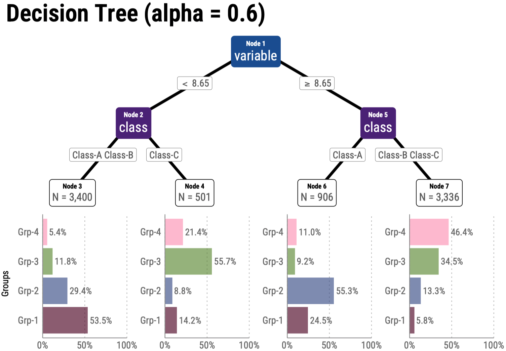

このブロックは summary です。  
<!\--more\--> までがリスト表示で出力されます。
summary: の設定より優先度が高いです。

<!--more-->

---

## PhotoSwipe Lightbox

<div class="pswp-gallery" id="gallery-base">
  <a href="https://cdn.photoswipe.com/photoswipe-demo-images/photos/2/img-2500.jpg" 
    data-pswp-width="1669" 
    data-pswp-height="2500"  
     target="_blank">
    
  </a>
  <a href="https://cdn.photoswipe.com/photoswipe-demo-images/photos/7/img-2500.jpg" 
    data-pswp-width="1875" 
    data-pswp-height="2500" 
     target="_blank">
    
  </a>
  <a href="https://cdn.photoswipe.com/photoswipe-demo-images/photos/2/img-2500.jpg" 
    data-pswp-width="1669" 
    data-pswp-height="2500"  
     target="_blank">
    
  </a>
  <a href="https://cdn.photoswipe.com/photoswipe-demo-images/photos/7/img-2500.jpg" 
    data-pswp-width="1875" 
    data-pswp-height="2500" 
     target="_blank">
    
  </a>
</div>

本文本文本文本文本文本文本文本文本文本文本文本文

## リスト

- ああああああああああああああ
  - いいいいいいいいいいいいいい
<!-- <p> -->
- うううううううううううううう
  - ええええええええええええええ

- ああああああああああああああ
  - うううううううううううううう
  - ええええええええええええええ

- ああああああああああああああ
- いいいいいいいいいいいいいい
  - うううううううううううううう
  - ええええええええええええええ

本文本文本文本文本文本文本文本文本文本文本文本文本文本文。

1. ああああああああああああ
   - ああああああああああああああ
   - いいいいいいいいいいいいいい
     - うううううううううううううう
     - ええええええええええええええ
2. いいいいいいいいいいいい
   1. ああああああああああああああああ
   2. いいいいいいいいいいいいいいいい
      - うううううううううううううううううう

本文本文本文本文本文本文本文本文本文本文本文本文本文本文本文。

---

1. [SITE.全ページ](https://gohugo.io/methods/site/allpages/) すべての言語のすべてのページのコレクションを返します。
   - [サイト.ページ](https://gohugo.io/methods/site/pages/)すべてのページのコレクションを返します。
   - [SITE.通常ページ](https://gohugo.io/methods/site/regularpages/)すべての通常ページのコレクションを返します。  
     ノート
     - 最初のレベルのセクションページのコレクションを返します。
     - [サイトセクション](https://gohugo.io/methods/site/sections/)最初のレベルのセクションページのコレクションを返します。
2. デフォルトでは、Hugo はページ コレクションを次のように並べ替えます。
   1.  [重さ](https://gohugo.io/methods/page/weight/)、[日付](https://gohugo.io/methods/page/date/)の降順
   2.  [LinkTitle が](https://gohugo.io/methods/page/linktitle/)[Title](https://gohugo.io/methods/page/title/)に戻る[](https://gohugo.io/methods/page/title/)
   3.  [](https://gohugo.io/methods/page/file/#filename)ページがファイルによってバックアップされている場合は[ファイル名](https://gohugo.io/methods/page/file/#filename)
       - これらのメソッドを使用してページ コレクションを並べ替えます。
       - これらのメソッドを使用してページ コレクションを並べ替えます。  
For example, the base template below calls the [partial](https://gohugo.io/functions/partials/include/) function to include partial templates for the `head`, `header`, and `footer` elements of each page, and it uses the [block](https://gohugo.io/functions/go-template/block/) function to include `home`, `single`, `section`, `taxonomy`, and `term` templates within the `main` element of each page.

## コード

```md {linenos=false, anchorLineNos=false}
r {name="abcde.R", lineNumbersInTable=true, lineNos=true,lineNoStart=1,hl_lines=[2,"7-8"]}
```

```r {name="abcde.R", lineNumbersInTable=true, lineNos=true,lineNoStart=1,hl_lines=[2,"7-8"]}
# この行はコメントアウト.
receipt %>% 
  summarise(amount = sum(amount), .by = "sales_ymd") %>% filter(between(amount, 120.34, 567.89))
  mutate(
    pre_sales_ymd = lag(sales_ymd, n = 1L, order_by = sales_ymd), 
    pre_amount = lag(amount, n = 1L, default = NA, order_by = sales_ymd)
  ) %>% 
  mutate(diff_amount = amount - pre_amount) %>% 
  arrange(sales_ymd) # コメント
```

R

```r {name="abcde.R", lineNos=false,lineNoStart=1,hl_lines=[2,"7-8"]}
# この行はコメントアウト.
receipt %>% 
  summarise(amount = sum(amount), .by = "sales_ymd") %>% filter(between(amount, 120.34, 567.89))
  mutate(
    pre_sales_ymd = lag(sales_ymd, n = 1L, order_by = sales_ymd), 
    pre_amount = lag(amount, n = 1L, default = NA, order_by = sales_ymd)
  ) %>% 
  mutate(diff_amount = amount - pre_amount) %>% 
  arrange(sales_ymd) # コメント
```

全ハイライト、アンカー付きのRのコードは以下のようになります。

```r {lineNumbersInTable=false,linenos=true,lineNoStart=14,hl_lines=[2,"3-8"],anchorLineNos=true}
receipt %>% 
  summarise(amount = sum(amount), .by = "sales_ymd") %>% 
  mutate(
    pre_sales_ymd = lag(sales_ymd, n = 1L, order_by = sales_ymd), 
    pre_amount = lag(amount, n = 1L, default = NA, order_by = sales_ymd)
  ) %>% 
  mutate(diff_amount = amount - pre_amount) %>% 
  arrange(sales_ymd) # コメント
```

SQL: 
```sql {lineNumbersInTable=true, linenos=true,lineNoStart=1,hl_lines=["2-4","9-12"]}
with customer_amount as (
  select
    customer_id, 
    SUM(amount) as total_amount
  from receipt
  where customer_id NOT LIKE 'Z%'
  group by customer_id
)
-- この行はコメントアウト.
select 
  *
from
  customer_amount
where 
  total_amount >= 3
order by
  total_amount DESC
```

## 演習問題

### 演習問題一覧の出力

```go-html-template {linenos=false,anchorLineNos=false}

or

or

```
⬇️


### 演習問題文の出力

read: /data/100k/questions.yaml

```go-html-template {linenos=false,anchorLineNos=false}
 <-- フロントマターから ed, id を取得


```



---



---



---

通常の文章。

{}

{}

## フォントファミリー (font-family)

179 g Q Ii Ll [R+SQL] データサイエンス100本ノック+α.

`179 g Q Ii Ll [R+SQL] データサイエンス100本ノック+α.`

**太字: 179 g Q Ii Ll [R+SQL] データサイエンス100本ノック+α.**

*斜体: 179 g Q Ii Ll [R+SQL] データサイエンス100本ノック+α.*

***太字+斜体: 179 g Q Ii Ll [R+SQL] データサイエンス100本ノック+α.***

## 絵文字

🧑‍💻 👨‍💻 👤 👾 🤖  
📈 📊 🔍 ⌨️ 🖥️ 💻 ⚙️ 🧠 🌐 🚀 🪐  
📁 📂 - フォルダ、リポジトリ  
📝 ✍️ - メモ  
📖 📒 🗒️ - ノート  
📘 📙 📕 📚 - 本  
⚠️ - 警告サイン, 最も一般的な注意や警告を示す絵文字  
❗ - 強い注意や緊急性を示す  
🔑 - 鍵、重要なポイントや核心を象徴します  
✔️ ☑️ ✅ - チェックマーク  
ℹ️ - 情報  
➡️ ⬅️ ⬆️ ⬇️ 👉  
:see_no_evil: :hear_no_evil: :speak_no_evil:

## Font Awesome

サイズなどのスタイル設定 → 


Alerts スタイルの参考サイト → 


<i class="fa-solid fa-circle-info"></i> 
<i class="fa-solid fa-lightbulb"></i>

<div style="text-align: center;">
  <i class="fa-solid fa-circle-info fa-3x" style="color: #0000FF;"></i>
  <div style="margin-top: 0.25em;">infomation</div>
  <p>スタイル設定</p>
</div>

## shortcodes {#shortcodes}

###  と {} の違い


<br></br>
PAGE.RenderShortcodes は、コンテンツファイル内のショートコードをレンダリングするが、
Markdown は保持されることに注意。

### .Page を使用

```go-html-template {linenos=false,anchorLineNos=false}

```
» 

### .Site.Params. を使用

```go-html-template {linenos=false,anchorLineNos=false}

```
➡️ 

```go-html-template {linenos=false,anchorLineNos=false}

```
→ 

```go-html-template {linenos=false,anchorLineNos=false}

```
→ 

```go-html-template {linenos=false,anchorLineNos=false}

```
→ 

### 部分テンプレートを使用 (partial)

1. text を渡さない場合はデフォルトが適用される
   ```go-html-template {linenos=false,anchorLineNos=false}
   
   ```
   → 

2. text を渡す場合
   ```go-html-template {linenos=false,anchorLineNos=false}
   
   ```
   → 

### param {#param}

1. huto.yaml -> param.k100site.title

   ```go-html-template {linenos=false,anchorLineNos=false}
     
   ```

   →   

2. content内のparams

   ```go-html-template {linenos=false,anchorLineNos=false}
   
   ```

   →   

   ```go-html-template {linenos=false,anchorLineNos=false}
   
   ```

   → 

### href-target-blank

aaaa  aaaa

```go-html-template {linenos=false,anchorLineNos=false}

```

→ 


```go-html-template {linenos=false,anchorLineNos=false}

```

→ 


```go-html-template {linenos=false,anchorLineNos=false}

```

→ 


```go-html-template {linenos=false,anchorLineNos=false}

```

→ 


```md {linenos=false,anchorLineNos=false}

```

→ 



```md {linenos=false,anchorLineNos=false}

```

→ 


### product\-name

```go-html-template {linenos=false,anchorLineNos=false}

```

→ 

### product\-link

```go-html-template {linenos=false,anchorLineNos=false}

```

→ 


```go-html-template {linenos=false,anchorLineNos=false}

```

→ 


### ref {#ref}

```go-html-template
    → 絶対URL
 → 相対URL
```

→  
  


- overview#bbb へのリンク

  ```md {linenos=false,anchorLineNos=false}
  [overview-BBB はこちら]( "overview-BBB")
  ```

  → [overview-BBB はこちら]( "overview-BBB")

- overview.md#d2 へのリンク

  ```md {linenos=false,anchorLineNos=false}
   [overview-d2 はこちら]( "About us")
  ```

  → [overview-d2 はこちら]( "About us")

  Rendered:
  ```html {lineNos=false}
  <a href="http://example.org/overview/#bbb" title="About us">こちら</a>
  ```

### relref

- overview#d2 へのリンク

  ```md {linenos=false,anchorLineNos=false}
  [overview-d2 はこちら]( "About us")
  ```
  → [overview-d2 はこちら]( "About us")  
  Rendered:
  ``` html {lineNos=false}
  <a href="overview/#bbb" title="About us">こちら</a>
  ```

- lang="ja"

  ```md {linenos=false,anchorLineNos=false}
  [lang="ja" はこちら]()
  ```

  → [lang="ja" はこちら]()  

### comment {#comment}

```go-html-template {linenos=false,anchorLineNos=false}
{} 
TODO: rewrite the paragraph below. 
{}
```

{} 
TODO: rewrite the paragraph below. 
{}

### details

```html {linenos=false,anchorLineNos=false}
 
This is a **bold** word. 

```
⬇️
 
This is a **bold** word. 


### figure {#figure}

```html {linenos=false,anchorLineNos=false}

```
👉  


### レーティング　(星で示す難易度)

```html {linenos=false,anchorLineNos=false}
  
```

0〜5段階 : 

難易度0:   
難易度1:   
  
難易度3:   
  
難易度5: 

### Data sources

read: assets/test/pets.csv

```html {linenos=false,anchorLineNos=false}

```
⬇️  


## Code block (chroma) {#code-block}

### Code block with ```

#### Rコード {#r}

Rのコードは以下のようになります。

```text
r {lineNumbersInTable=true, lineNos=true,lineNoStart=1,hl_lines=[2,"7-8"]}
```

→ 

```r {lineNumbersInTable=true, lineNos=true,lineNoStart=1,hl_lines=[2,"7-8"]}
receipt %>% 
  summarise(amount = sum(amount), .by = "sales_ymd") %>% 
  mutate(
    pre_sales_ymd = lag(sales_ymd, n = 1L, order_by = sales_ymd), 
    pre_amount = lag(amount, n = 1L, default = NA, order_by = sales_ymd)
  ) %>% 
  mutate(diff_amount = amount - pre_amount) %>% 
  arrange(sales_ymd) # コメント
```

```
r {lineNumbersInTable=false, lineNoStart=1,hl_lines=[2,"7-8"]}
```

→ 

```r {lineNumbersInTable=false, lineNoStart=1,hl_lines=[2,"7-8"]}
receipt %>% 
  summarise(amount = sum(amount), .by = "sales_ymd") %>% 
  mutate(
    pre_sales_ymd = lag(sales_ymd, n = 1L, order_by = sales_ymd), 
    pre_amount = lag(amount, n = 1L, default = NA, order_by = sales_ymd)
  ) %>% 
  mutate(diff_amount = amount - pre_amount) %>% 
  arrange(sales_ymd) # コメント
```

全ハイライト、アンカー付きのRのコードは以下のようになります。

```r {lineNumbersInTable=true,lineNoStart=14,hl_lines=[2,"3-8"],anchorLineNos=true}
receipt %>% 
  summarise(amount = sum(amount), .by = "sales_ymd") %>% 
  mutate(
    pre_sales_ymd = lag(sales_ymd, n = 1L, order_by = sales_ymd), 
    pre_amount = lag(amount, n = 1L, default = NA, order_by = sales_ymd)
  ) %>% 
  mutate(diff_amount = amount - pre_amount) %>% 
  arrange(sales_ymd) # コメント
```

Rのコードは上記のようになります。

次はSQLです。

#### SQL

SQLのコードは以下のようになります。

```sql {linenos=true,lineNoStart=1,hl_lines=["9-16"]}
with customer_amount as (
  select
    customer_id, 
    SUM(amount) as total_amount
  from receipt
  where customer_id NOT LIKE 'Z%'
  group by customer_id
)
select 
  *
from
  customer_amount
where 
  total_amount >= (select AVG(total_amount) from customer_amount)
order by
  total_amount DESC
```

次は go-html-template コードです。

#### go-html-template コード

go-html-template のコードは以下のようになります。

```go-html-template {linenos=true,lineNoStart=1,hl_lines=["5-16"]}
<div><p>xxxxxxxxxxxxxxxxxxxxxx</p></div>
{{ if eq .Type "alert" }}
  <blockquote class="alert alert-{{ .AlertType }}">
    <p class="alert-heading">
      {{ transform.Emojify (index $emojis .AlertType) }}
      {{ with .AlertTitle }}
        {{ . }}
      {{ else }}
        {{ or (i18n .AlertType) (title .AlertType) }}
      {{ end }}
    </p>
    {{ .Text }}
  </blockquote>
{{ else }}
  <blockquote>
    {{ .Text }}
  </blockquote>
{{ end }}
```

次は go-text-template コードです。

#### go-text-template コード

go-text-template のコードは以下のようになります。

```go-text-template {linenos=false,anchorLineNos=false}
<div><p>xxxxxxxxxxxxxxxxxxxxxx</p></div>
{{ if eq .Type "alert" }}
  <blockquote class="alert alert-{{ .AlertType }}">
    <p class="alert-heading">
      {{ transform.Emojify (index $emojis .AlertType) }}
      {{ with .AlertTitle }}
        {{ . }}
      {{ else }}
        {{ or (i18n .AlertType) (title .AlertType) }}
      {{ end }}
    </p>
    {{ .Text }}
  </blockquote>
{{ else }}
  <blockquote>
    {{ .Text }}
  </blockquote>
{{ end }}
```

次は yaml です。

#### yaml

```yml {linenos=false}
params:
  assets:
    disableFingerprinting: true
```

次は text です。

#### textコード

```text {linenos=true,lineNoStart=1,hl_lines=["3-4",23], anchorLineNos=true}
100k
├── matome
│   ├── _index.md
│   └── tree.png
├── _index.md
├── advanced
│   ├── _index.md
│   └── ...
├── overview
│   └── index.md
├── setup
│   ├── index.md
│   └── line.png
├── standard
│   ├── _index.md
│   ├── r-003.md
│   └── r-028.md
└── tips
    └── index.md
```

Hugo's internal highlight. ⬇️

### Code block with Hugo's internal highlight shortcode {#code}

Rのコードは以下のようになります。


receipt %>% 
  summarise(amount = sum(amount), .by = "sales_ymd") %>% 
  mutate(
    pre_sales_ymd = lag(sales_ymd, n = 1L, order_by = sales_ymd), 
    pre_amount = lag(amount, n = 1L, default = NA, order_by = sales_ymd)
  ) %>% 
  mutate(diff_amount = amount - pre_amount) %>% 
  arrange(sales_ymd) # コメント


htmlのコードは以下のようになります。


{{ range .Pages }}
  <h2><a href="{{ .RelPermalink }}">{{ .LinkTitle }}</a></h2>
{{ end }}


go-html-template のコードは以下のようになります。


{{ range .Pages }}
  <h2><a href="{{ .RelPermalink }}">{{ .LinkTitle }}</a></h2>
{{ end }}


go-html-template のコードは上記のようになります。

## Markdown

### Markdown attributes

#### paragraph (段落)

```md {lineNos=false}
This is a paragraph.
{class="foo bar" id="baz"}
```
→  
This is a paragraph.
{class="foo bar" id="baz"}

``` {lineNos=false}
This is a paragraph.
{.foo .bar #baz}
```
→  
This is a paragraph.
{.foo .bar #baz}

Rendered: 
```html {lineNos=false}
<p class="foo bar" id="baz">This is a paragraph.</p>
```

#### blockquote {#blockquote}

``` {lineNos=false}
> This is a blockquote.
{class="foo bar"}
```
→ 

> This is a blockquote.
{class="foo bar"}
<!-- {class="foo bar" hidden=hidden} -->

Rendered: 
```html {lineNos=false}
<blockquote class="foo bar">
  <p>This is a blockquote.</p>
</blockquote>
```

### 引用 (\>, \>>)

#### 出典を明記しない引用

> *ブロック引用符内*でマークダウン構文を使用できることに**注意してください**。

``` {lineNos=false}
> - aaaaaaaaaaaaaaaaaaaaa
> - bbbbbbbbbbbbbbbbbbbbb
>> xxxxxxxxxxxxxxxxxxxxxxxxxxxx
```
→ 
> - aaaaaaaaaaaaaaaaaaaaa
> - bbbbbbbbbbbbbbbbbbbbb
>> xxxxxxxxxxxxxxxxxxxxxxxxxxxx

#### 出典を明記した引用

```htm {lineNos=false}
> Don't communicate by sharing memory, share memory by communicating.
>
> — <cite>Rob Pike[^3]</cite>
```
→ 
> Don't communicate by sharing memory, share memory by communicating.
> 
> — <cite>Rob Pike[^3]</cite>

[^3]: The above quote is excerpted from Rob Pike's [talk](https://www.youtube.com/watch?v=PAAkCSZUG1c) during Gopherfest, November 18, 2015.

#### footerを明記した引用

```html {lineNos=false}
> Don't communicate by sharing memory, share memory by communicating.
> <footer>Rob Pike</footer>
```
→ 
> Don't communicate by sharing memory, share memory by communicating.
> <footer>Rob Pike</footer>

### アラート (Alerts) {#alerts}

定義ファイル:
- layouts/_default/_markup/render-blockquote.html
- i18n/ja.yaml
- レイアウトの参考:  
    
  

```text {lineNos=false}
> [!TIP]
> Helpful advice for doing things better or more easily.
```

この blockquote レンダリング フックは、アラート指定子が存在する場合は多言語アラートをレンダリングする。

> [!NOTE]
> この blockquote レンダリング フックは、アラート指定子が存在する場合は多言語アラートをレンダリングし、
> それ以外の場合は CommonMarkdown の仕様に従って blockquote をレンダリングします。

この blockquote レンダリング フックは、アラート指定子が存在する場合は多言語アラートをレンダリングする。

> [!TIP]
> Helpful advice for doing things better or more easily.

この blockquote レンダリング フックは、アラート指定子が存在する場合は多言語アラートをレンダリングする。

> [!IMPORTANT]
> Key information users need to know to achieve their goal.

この blockquote レンダリング フックは、アラート指定子が存在する場合は多言語アラートをレンダリングする。

> [!WARNING]
> Urgent info that needs immediate user attention to avoid problems.

CAUTION は無し

### 注釈

テキスト[^1]  
テキスト[^2]

[^1]: 注釈1の内容

[^2]: 注釈2の内容

### Inline Code

これは `This is Inline Code` です。

### convert CSV to Markdown table

| aaaaaa   | bbbbbb   | cccccc   |
| ---: | :---: | :--- |
| 1   | 2   | 3   |

### convert Markdown table to CSV

aaaaaa,bbbbbb,cccccc  
1,2,3

### エスケープ (\\)

例2： \### aaa  
例1： \`インライン表示されなくなる`  

### 段落

テキストの行間に空白行を残すことで、新しい段落を作成できる.

### 改行

末尾にバックスラッシュ(\\)かスペース2つを含める: \
aaaaaaaaaaaaaaaaaa\
bbbbbbbbbbbbbbbbbbbbbb

### フォント

<pre>これはPlainテキスト。</pre>

```html {linenos=false,anchorLineNos=false}
<font color="Red">カラーテキスト</font>
```
→ <font color="Red">カラーテキスト</font>

\~ or ~~: \
~~打ち消し線~~  
ABC ~打ち消し線~ XYZ  

\*, **, ***: \
*斜体*  
**太字 Igl**  
***太字と斜体 Igl***

<i>このテキストは斜体です</i>
<em>このテキストは強調（斜体）されています</em>

\<ins>: \
これは<ins>下線付きの文章</ins>です。

\<sub> :\
これは下付き<sub>テキスト</sub>です。

\<sup>: \
これは上付き<sup>テキスト</sup>です。

\<mark>: \
Most <mark>salamanders</mark> are nocturnal, and hunt for insects, worms, and other small creatures.

\<kbd>: \
Press <kbd><kbd>CTRL</kbd>+<kbd>ALT</kbd>+<kbd>Delete</kbd></kbd> to end the session.


### タスクリスト

- [x] aaaaaaaaaaaaaaaaa
- [ ] bbbbbbbbbbbbbbbbbb
- [x] cccccccccccccccccccc 


### 記号

...  
<< >>  
'  ‘  ’  "  ”  

--  

### 画像

shortcodes: figure を使う！

``` md

```


---

### リスト

リストの前にギャップがある.
1. [SITE.全ページ](https://gohugo.io/methods/site/allpages/) すべての言語のすべてのページのコレクションを返します。
   - [サイト.ページ](https://gohugo.io/methods/site/pages/)すべてのページのコレクションを返します。
   - [SITE.通常ページ](https://gohugo.io/methods/site/regularpages/)すべての通常ページのコレクションを返します。  
     ノート
     - 最初のレベルのセクションページのコレクションを返します。
     - [サイトセクション](https://gohugo.io/methods/site/sections/)最初のレベルのセクションページのコレクションを返します。

2. デフォルトでは、Hugo はページ コレクションを次のように並べ替えます。

   1.  [重さ](https://gohugo.io/methods/page/weight/)、[日付](https://gohugo.io/methods/page/date/)の降順
   2.  [LinkTitle が](https://gohugo.io/methods/page/linktitle/)[Title](https://gohugo.io/methods/page/title/)に戻る[](https://gohugo.io/methods/page/title/)
   3.  [](https://gohugo.io/methods/page/file/#filename)ページがファイルによってバックアップされている場合は[ファイル名](https://gohugo.io/methods/page/file/#filename)
       - これらのメソッドを使用してページ コレクションを並べ替えます。
       - これらのメソッドを使用してページ コレクションを並べ替えます。  
For example, the base template below calls the [partial](https://gohugo.io/functions/partials/include/) function to include partial templates for the `head`, `header`, and `footer` elements of each page, and it uses the [block](https://gohugo.io/functions/go-template/block/) function to include `home`, `single`, `section`, `taxonomy`, and `term` templates within the `main` element of each page.

A home template renders your site’s home page. For a single page site this is the only required template. For example, the home template below inherits the site’s shell from the base template, and renders the home page content with a list of pages.

ショートコードの定義方法に応じて、引数は名前付き、位置指定、またはその両方になりますが、1 回の呼び出しで引数タイプを混在させることはできません。

---

## H2 全角と半角のサイズ比較 (alphabet)

## h2 example

### H3 部分テンプレート

### h3 example

#### H4 部分テンプレート

#### h4 alphabet

ショートコードの定義方法に応じて、引数は名前付き、位置指定、またはその両方になりますが、1 回の呼び出しで引数タイプを混在させることはできません。

## H2 見出し2 ショートコード

Hugo は、特定のページのテンプレートを選択する際に、以下にリストされているパラメータを考慮します。テンプレートは、詳細度によって順序付けられています。

### H3 見出し3 埋め込みショートコード

Hugo は、特定のページのテンプレートを選択する際に、以下にリストされているパラメータを考慮します。テンプレートは、詳細度によって順序付けられています。

```go-html-template {linenos=false,anchorLineNos=false}
{} 
TODO: rewrite the paragraph below. 
{}
```

これは自然なことのはずですが、さまざまなパラメータのバリエーションの具体的な例については、以下の表をご覧ください。

ショートコードの定義方法に応じて、引数は名前付き、位置指定、またはその両方になりますが、1 回の呼び出しで引数タイプを混在させることはできません。

#### H4 見出し4 コンテンツファイル内のシンプルなスニペット

ショートコードの定義方法に応じて、引数は名前付き、位置指定、またはその両方になりますが、1 回の呼び出しで引数タイプを混在させることはできません。名前付き引数の形式は、`name="value"`という形式の HTML の形式をモデルにしています。

#### H4 見出し4 ショートコード

Hugo は、特定のページのテンプレートを選択する際に、以下にリストされている**パラメータ**を考慮します。**テンプレート**は、詳細度によって順序付けられています。

```r {linenos=true,lineNoStart=1,hl_lines=[2,"7-8"]}
receipt %>% 
  summarise(amount = sum(amount), .by = "sales_ymd") %>% 
  mutate(
    pre_sales_ymd = lag(sales_ymd, n = 1L, order_by = sales_ymd), 
    pre_amount = lag(amount, n = 1L, default = NA, order_by = sales_ymd)
  ) %>% 
  mutate(diff_amount = amount - pre_amount) %>% 
  arrange(sales_ymd) # コメント
```

これは自然なことのはずですが、さまざまなパラメータのバリエーションの具体的な例については、以下の表をご覧ください。

##### H5 見出し5

Hugo は、特定のページのテンプレートを選択する際に、以下にリストされているパラメータを考慮します。テンプレートは、詳細度によって順序付けられています。

これは自然なことのはずですが、さまざまなパラメータのバリエーションの具体的な例については、以下の表をご覧ください。

###### H6 見出し6

Hugo は、特定のページのテンプレートを選択する際に、以下にリストされているパラメータを考慮します。

テンプレートは、詳細度によって順序付けられています。これは自然なことのはずですが、さまざまなパラメータのバリエーションの具体的な例については、以下の表をご覧ください。

#### H4 ページセクション

現在のセクション内の通常のページと、直下の子孫セクションのセクション ページのコレクションを返します。

#### H4 PAGE.通常ページ

現在のセクション内の通常のページのコレクションを返します。

#### H4 PAGE.RegularPagesRecursive

現在のセクション内の通常のページと、すべての子孫セクション内の通常のページのコレクションを返します。

## H2 見出し2 セクションには、1つ以上の祖先 (ホームページを含む) と、0個以上の子孫があります

### H3 見出し3 ショートコードは、組み込みテンプレートまたはカスタムテンプレートを呼び出すコンテンツファイル内のシンプルなスニペット

#### H4 見出し4 ショートコードは、組み込みテンプレートまたはカスタムテンプレートを呼び出すコンテンツファイル内のシンプルなスニペット

Hugo は、特定のページのテンプレートを選択する際に、以下にリストされているパラメータを考慮します。テンプレートは、詳細度によって順序付けられています。これは自然なことのはずですが、さまざまなパラメータのバリエーションの具体的な例については、以下の表をご覧ください。

#### alphabet

指定されたページの直下のセクションごとに 1 つずつ、セクション ページのコレクションを返します。

### Mathematics in Markdown

- This is an inline \(a^*=x-b^*\) equation.

- These are block equations:

\[a^*=x-b^*\]

\[ a^*=x-b^* \]

\[
a^*=x-b^*
\]

- These are also block equations:

$$a^*=x-b^*$$

$$ a^*=x-b^* $$

$$
a^*=x-b^*
$$

- aligned

\[
\begin{aligned}
KL(\hat{y} || y) &= \sum_{c=1}^{M}\hat{y}_c \log{\frac{\hat{y}_c}{y_c}} \\
JS(\hat{y} || y) &= \frac{1}{2}(KL(y||\frac{y+\hat{y}}{2}) + KL(\hat{y}||\frac{y+\hat{y}}{2}))
\end{aligned}
\]

-  math contexts の外では$をダブルエスケープする: 

```text {lineNos=false}
A \\$5 bill _saved_ is a \\$5 bill _earned_.
```

→  A \\$5 bill _saved_ is a \\$5 bill _earned_.

- Chemistry

$$C_p[\ce{H2O(l)}] = \pu{75.3 J // mol K}$$

## Diagrams

### GoAT diagrams (ASCII) 

```goat
      .               .                .               .--- 1          .-- 1     / 1
     / \              |                |           .---+            .-+         +
    /   \         .---+---.         .--+--.        |   '--- 2      |   '-- 2   / \ 2
   +     +        |       |        |       |    ---+            ---+          +
  / \   / \     .-+-.   .-+-.     .+.     .+.      |   .--- 3      |   .-- 3   \ / 3
 /   \ /   \    |   |   |   |    |   |   |   |     '---+            '-+         +
 1   2 3   4    1   2   3   4    1   2   3   4         '--- 4          '-- 4     \ 4

```

## shortcodes (SNS)

### twitter

```html {linenos=false,anchorLineNos=false}

```
→ 


---

### instagram

<!-- https://www.instagram.com/p/CxOWiQNP2MO/ -->
<!--  -->

<!-- https://www.instagram.com/p/C9Tq0qdPSTF -->

```html {linenos=false,anchorLineNos=false}

```
→ 


---

### youtube

```html {linenos=false,anchorLineNos=false}

```
→ 

<!-- https://www.youtube.com/watch?v=0RKpf3rK57I -->

---

### vimeo

```html {linenos=false,anchorLineNos=false}

```
→ 

<!-- https://vimeo.com/channels/staffpicks/55073825 -->

